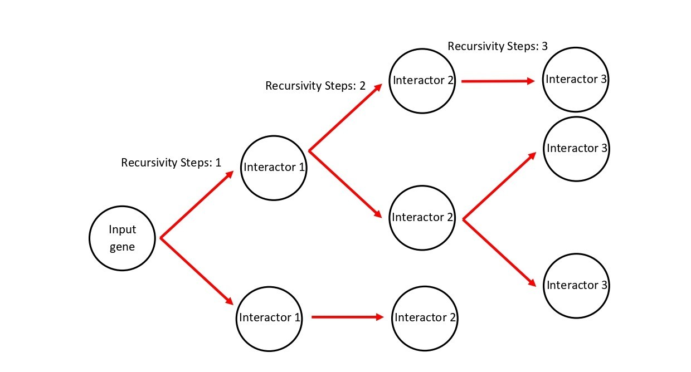

## Program description and usage
This program searches the interactions for the given genes in the input list, but only from Arabidopsis thaliana.
Afterwards, it builds the interaction networks for each input gene with all the interactors, that are also present in the input list (given a specified number of recursivity steps).
The number of recursivity steps determine the lenght of the network. That means that if this number is 2, the program will search the interactors for the input genes, but also for the genes tha interact with
these interactors. If we add another recursivity step, the program will also search for the interactors of the last interactors of the network with n-1 steps of recursivity.
This is represented in the next image:

Moreover, the networks are built accompanied by the GO IDs, GO Terms, KEGG IDs and KEGG Pathways of the interacting members. The program will output the results in the "Output file" that the user indicates.

The usage of this programs would be like this:

ruby Main.rb "Input gene list file" "Output file" "steps of recursivity"

Example with 2 steps of recursivity:

ruby Main.rb ArabidopsisSubNetwork_GeneList.txt Output.txt 2

The Main.rb file calls the Networks.rb file, that contains the class InteractionNetwork, where the list interactions are stored, with its GOs and KEEGs.
However, I also upload the file Networks_deep.rb, which outputs the same results, but also store the interactions (and the GOs and KEEGs) for all of the input genes,
with other genes no matter these interactors are in the list or not. Consequently, this program lasts more time to be completly ran.

