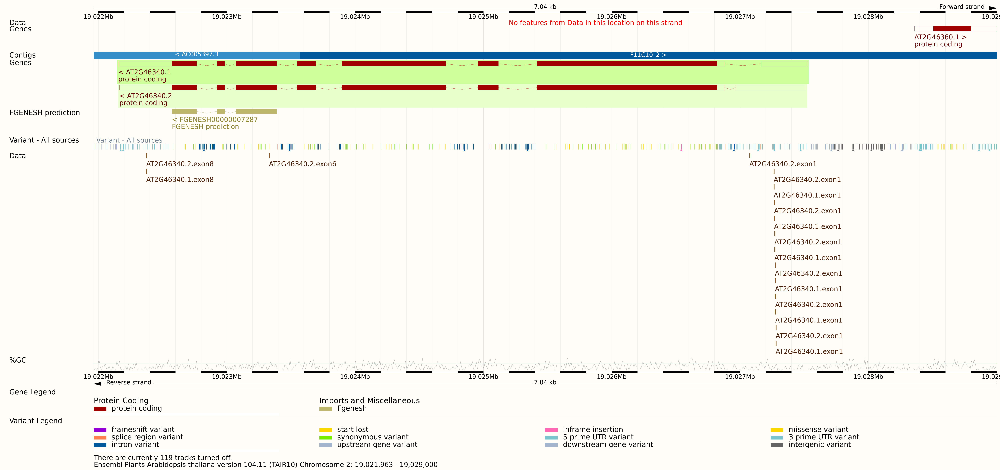

## Program description and usage
This program searches for the CTTCTT repetition in the exons of a given genes in the input list.
Afterwards, it outputs three different files: a file with the identifiers of the genes that do not contain the CTTCTT repetition, a gff3 file with the positions of this feature in the genes,
and another gff3 file with the positions of this feature in the chromosomes.

The usage of this programs would be like this:

ruby Main.rb "ArabidopsisSubNetwork_GeneList.txt"
"Output file with the genes that do not contain the CTTCTT repeat"
"GFF3 file with the positions of the CTTCTT repetition in the genes"
"GFF3 file with the positions of the CTTCTT repetition in the chromosomes"

Example:

ruby Main.rb ArabidopsisSubNetwork_GeneList.txt No_cttctt_file.txt Gff3_genes.txt Gff3_chr.txt

To prove that the program works well, in the next image it is shown the GFF track of the program beside the AT2G46340 gene on the ENSEMBL website.
